# 🔄 Complete JavaScript Event Loop Guide
**Call Stack, Web APIs, Callback Queue, Microtasks — Explained with Moving Diagrams**

---

## 📊 Visual Diagrams

### 1. The Big Picture: JavaScript Runtime Architecture

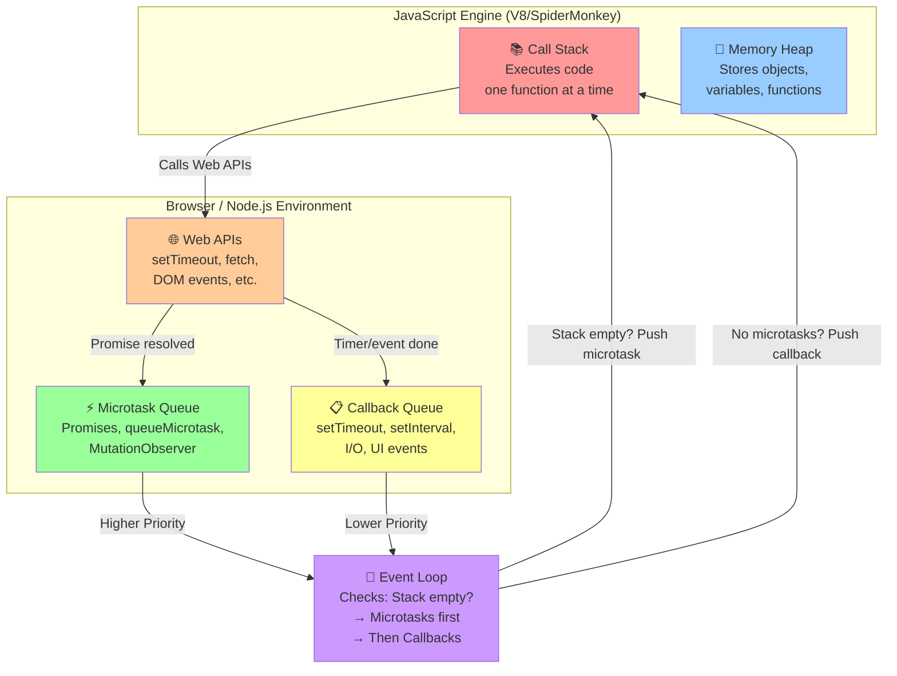

---

### 2. Event Loop — Step-by-Step Flow

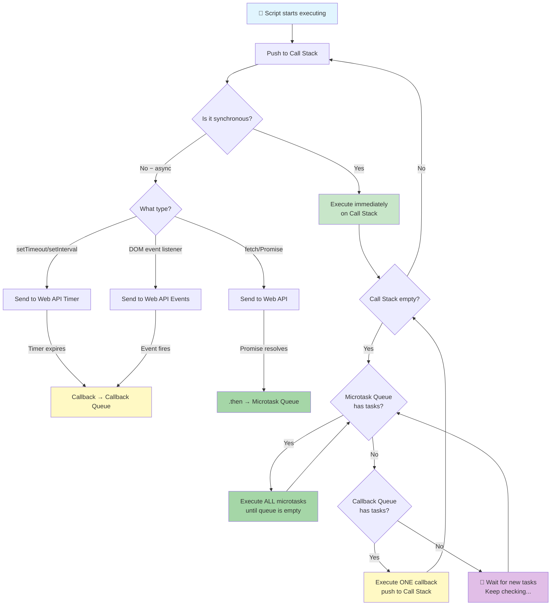

---

### 3. Microtask vs Macrotask Priority

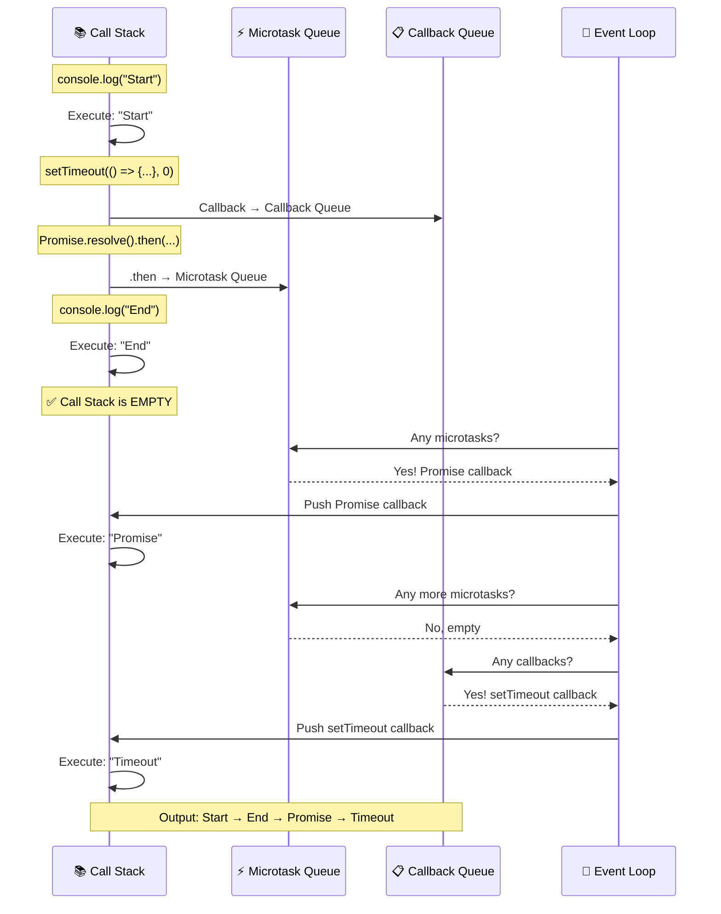

---

### 4. setTimeout(fn, 0) — Why It's NOT Instant

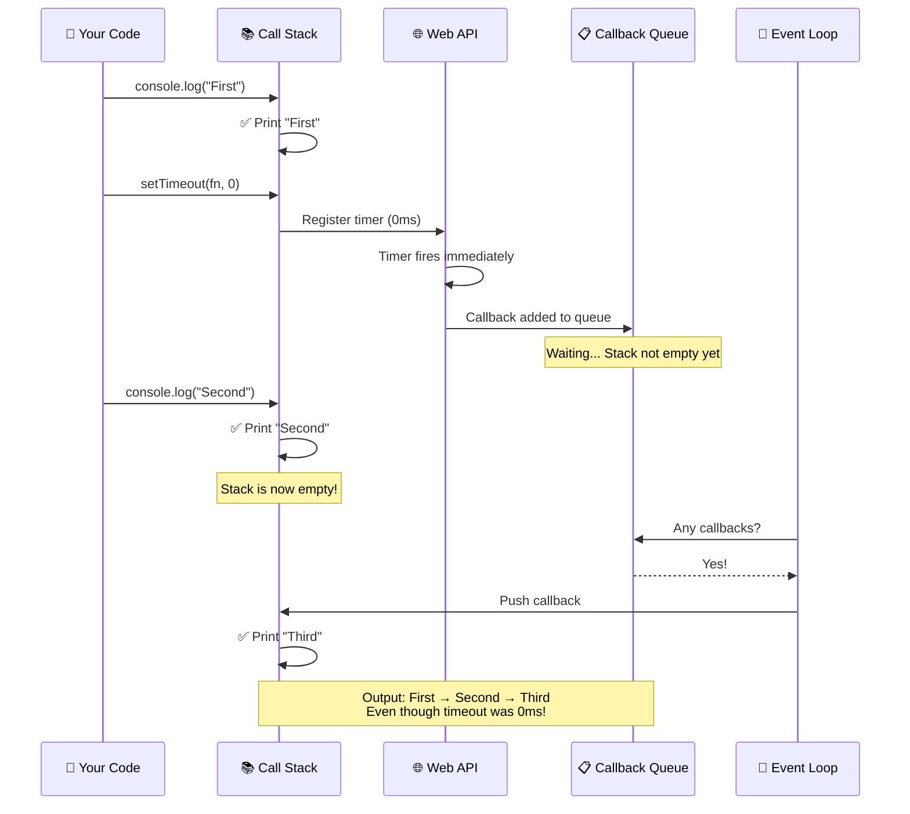

---

### 5. Nested Promises & Microtask Chaining

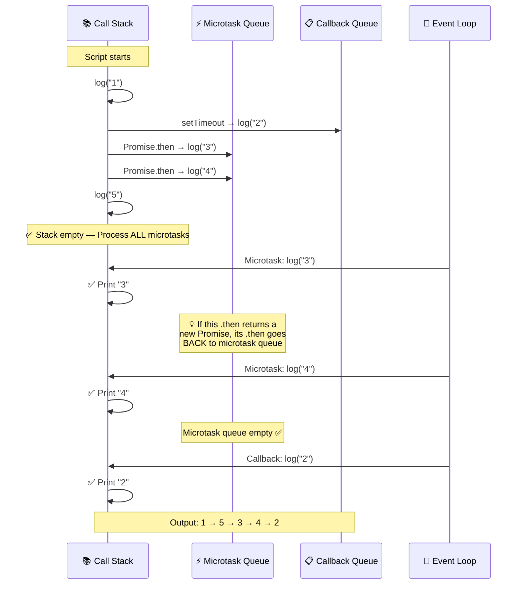

---

### 6. async/await Under the Hood

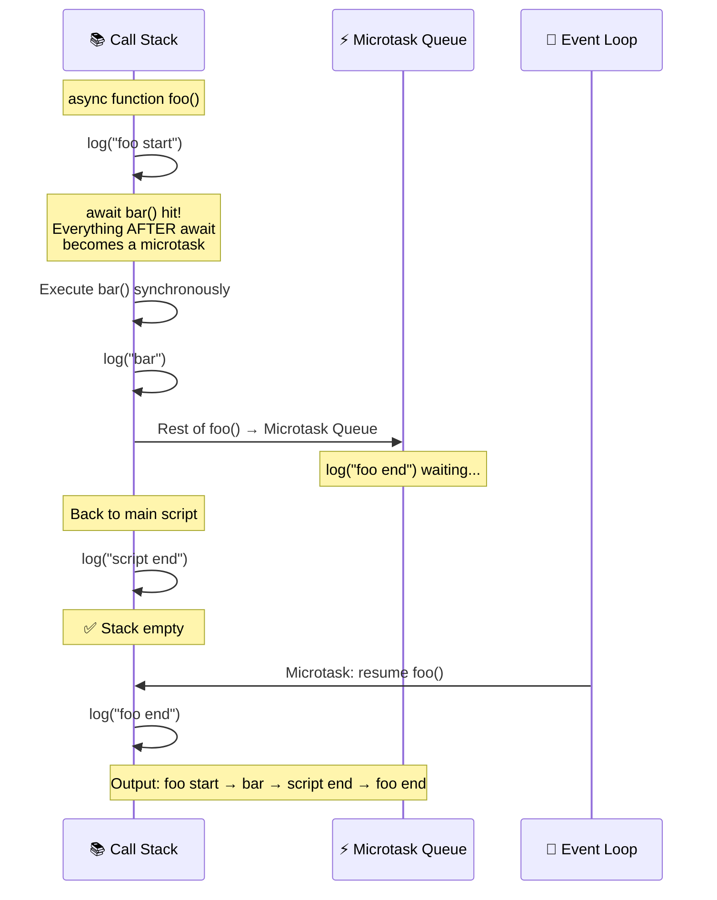

---

### 7. Complete Execution Model (Everything Together)

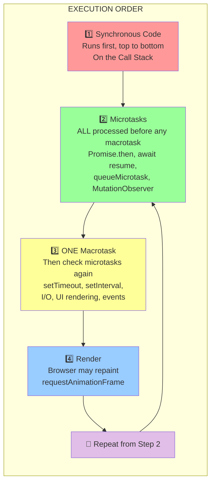

---

### 8. Blocking vs Non-Blocking

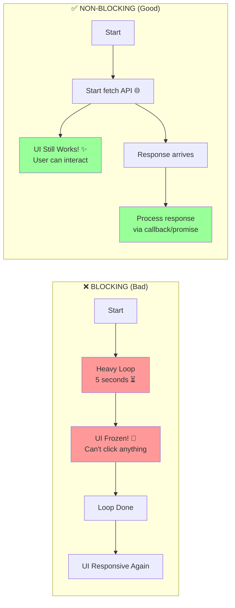

---

### 9. Real Scenario: fetch + DOM + setTimeout Interaction

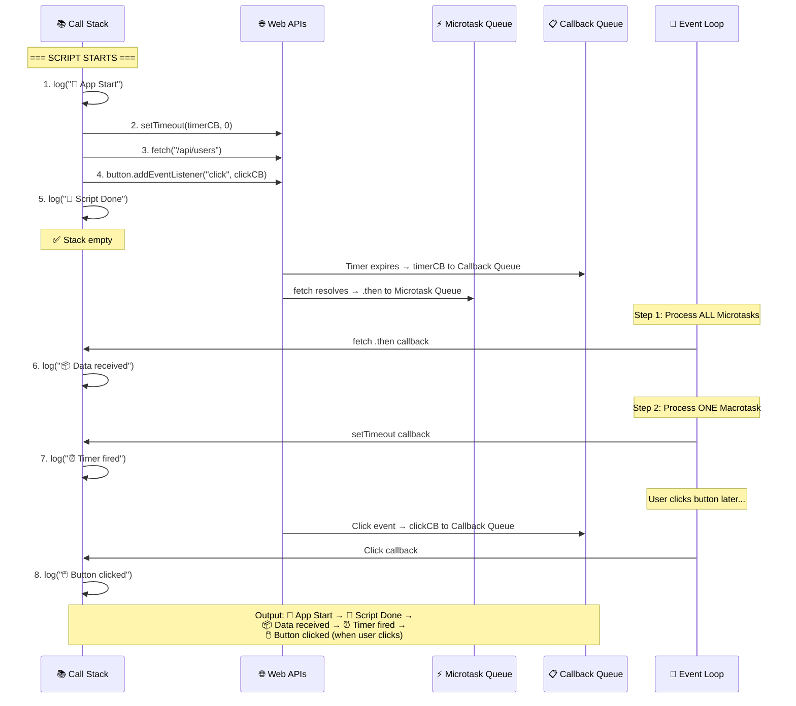

---

### 10. Promise Chain vs setTimeout Race

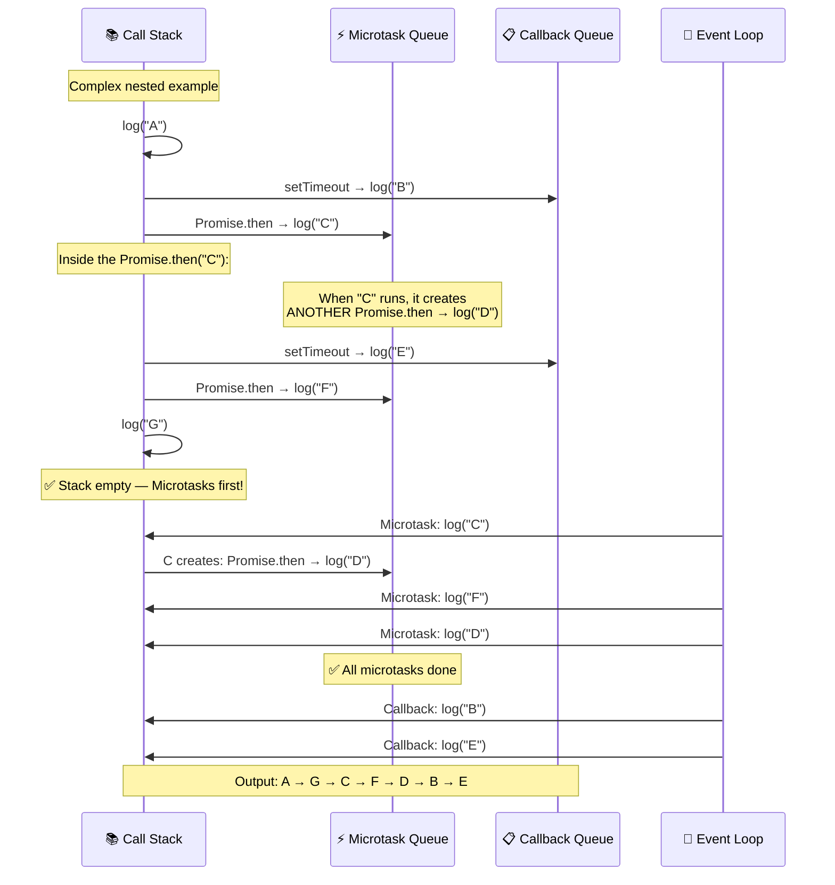

---

## 🎓 Detailed Explanations with Code Examples

### **Example 1: The Classic — Proving JavaScript is Single-Threaded**

```javascript
console.log("1 - Start");

setTimeout(function() {
    console.log("2 - setTimeout");
}, 0);

Promise.resolve().then(function() {
    console.log("3 - Promise");
});

console.log("4 - End");
```

**Output:**
```
1 - Start
4 - End
3 - Promise
2 - setTimeout
```

**Why this order?**
| Step | What Happens | Where |
|------|-------------|-------|
| 1 | `console.log("1 - Start")` runs | Call Stack (sync) |
| 2 | `setTimeout` registered | Sent to Web API → Callback Queue |
| 3 | `Promise.resolve().then()` registered | → Microtask Queue |
| 4 | `console.log("4 - End")` runs | Call Stack (sync) |
| 5 | Stack empty → process microtasks | `"3 - Promise"` runs |
| 6 | Microtasks empty → process callbacks | `"2 - setTimeout"` runs |

---

### **Example 2: Multiple Promises vs Multiple Timeouts**

```javascript
console.log("Start");

setTimeout(() => console.log("Timeout 1"), 0);
setTimeout(() => console.log("Timeout 2"), 0);

Promise.resolve().then(() => console.log("Promise 1"));
Promise.resolve().then(() => console.log("Promise 2"));

console.log("End");
```

**Output:**
```
Start
End
Promise 1
Promise 2
Timeout 1
Timeout 2
```

**Key Rule:** ALL microtasks run before ANY macrotask. Both promises run before either timeout.

---

### **Example 3: Chained Promises Create More Microtasks**

```javascript
console.log("Start");

setTimeout(() => console.log("Timeout"), 0);

Promise.resolve()
    .then(() => {
        console.log("Promise 1");
        return Promise.resolve();
    })
    .then(() => {
        console.log("Promise 2");
    });

Promise.resolve().then(() => console.log("Promise 3"));

console.log("End");
```

**Output:**
```
Start
End
Promise 1
Promise 3
Promise 2
Timeout
```

**Why Promise 3 comes before Promise 2?**
- `Promise 1` and `Promise 3` are both queued as microtasks initially
- `Promise 1` runs first (queued first), creates a new promise → `Promise 2` goes to *end* of microtask queue  
- `Promise 3` runs next (it was already in queue before `Promise 2`)
- `Promise 2` runs last among microtasks
- `Timeout` runs after all microtasks are done

---

### **Example 4: async/await Execution Order**

```javascript
async function foo() {
    console.log("foo start");
    await bar();
    console.log("foo end");         // This becomes a microtask!
}

async function bar() {
    console.log("bar");
}

console.log("script start");
foo();
console.log("script end");
```

**Output:**
```
script start
foo start
bar
script end
foo end
```

**Step-by-Step Breakdown:**

```
📚 Call Stack                    ⚡ Microtask Queue

1. log("script start")          (empty)
   → prints "script start"

2. foo() called                  (empty)
   → prints "foo start"

3. await bar()                   (empty)
   → bar() runs SYNCHRONOUSLY
   → prints "bar"
   → await pauses foo()
   → rest of foo() → microtask    ["foo end"]

4. log("script end")            ["foo end"]
   → prints "script end"

5. Stack empty! Process microtasks
   → resume foo()               (empty)
   → prints "foo end"
```

---

### **Example 5: The Tricky Nested setTimeout + Promise**

```javascript
console.log("1");

setTimeout(() => {
    console.log("2");
    Promise.resolve().then(() => console.log("3"));
}, 0);

Promise.resolve().then(() => {
    console.log("4");
    setTimeout(() => console.log("5"), 0);
});

console.log("6");
```

**Output:**
```
1
6
4
2
3
5
```

**Visualization:**
```
PHASE 1: Synchronous
─────────────────────────────────
Call Stack: log("1") → log("6")
Callback Queue: [setTimeout-A]
Microtask Queue: [Promise-A]

PHASE 2: Microtasks (drain ALL)
─────────────────────────────────
Execute Promise-A → log("4")
  └─ Creates setTimeout-B → Callback Queue
Callback Queue: [setTimeout-A, setTimeout-B]
Microtask Queue: (empty)

PHASE 3: ONE Macrotask
─────────────────────────────────
Execute setTimeout-A → log("2")
  └─ Creates Promise-B → Microtask Queue
Microtask Queue: [Promise-B]

PHASE 4: Microtasks again (before next macrotask!)
─────────────────────────────────
Execute Promise-B → log("3")
Microtask Queue: (empty)

PHASE 5: Next Macrotask
─────────────────────────────────
Execute setTimeout-B → log("5")
```

---

### **Example 6: queueMicrotask**

```javascript
console.log("Start");

queueMicrotask(() => console.log("Microtask 1"));

setTimeout(() => console.log("Timeout 1"), 0);

queueMicrotask(() => console.log("Microtask 2"));

Promise.resolve().then(() => console.log("Promise 1"));

console.log("End");
```

**Output:**
```
Start
End
Microtask 1
Microtask 2
Promise 1
Timeout 1
```

**`queueMicrotask`** and **`Promise.then`** both go into the **same microtask queue**. They run in the order they were added, and ALL run before any setTimeout callback.

---

### **Example 7: requestAnimationFrame Position**

```javascript
console.log("Start");

requestAnimationFrame(() => console.log("rAF"));

setTimeout(() => console.log("Timeout"), 0);

Promise.resolve().then(() => console.log("Promise"));

console.log("End");
```

**Output (typical):**
```
Start
End
Promise
Timeout
rAF          ← runs before next repaint, usually after macrotasks
```

> **Note:** `requestAnimationFrame` timing depends on the browser's repaint cycle (~16ms at 60fps). It typically runs after microtasks and before or after the next macrotask, depending on when the browser schedules a paint.

---

### **Example 8: Microtask Starvation (Dangerous!)**

```javascript
// ⚠️ WARNING: This will FREEZE the browser!
function endlessPromise() {
    Promise.resolve().then(() => {
        console.log("microtask");
        endlessPromise(); // Creates another microtask FOREVER
    });
}

endlessPromise();
setTimeout(() => console.log("I will NEVER run"), 0);
```

**What happens?**
- Each microtask creates a new microtask
- The Event Loop ALWAYS drains ALL microtasks before processing macrotasks
- The setTimeout callback will **never** run
- The browser tab will **freeze** because it never gets to render

```
⚡ Microtask Queue: [task1]
→ Execute task1 → creates task2
⚡ Microtask Queue: [task2]
→ Execute task2 → creates task3
⚡ Microtask Queue: [task3]
→ ... INFINITE LOOP! Never reaches Callback Queue or Render
```

---

### **Example 9: The Interview Favorite — Complex Mix**

```javascript
console.log("1");

setTimeout(() => {
    console.log("2");
    new Promise(resolve => {
        console.log("3");
        resolve();
    }).then(() => {
        console.log("4");
    });
}, 0);

new Promise(resolve => {
    console.log("5");
    resolve();
}).then(() => {
    console.log("6");
}).then(() => {
    console.log("7");
});

setTimeout(() => {
    console.log("8");
}, 0);

console.log("9");
```

**Output:**
```
1
5
9
6
7
2
3
4
8
```

**Complete Breakdown:**

```
═══════════════════════════════════════════════════════
SYNCHRONOUS EXECUTION (Call Stack)
═══════════════════════════════════════════════════════
• log("1")              → prints 1
• setTimeout(cbA, 0)    → cbA → Callback Queue
• new Promise(executor) → executor runs SYNCHRONOUSLY!
  └─ log("5")           → prints 5
  └─ resolve()          → .then(log "6") → Microtask Queue
• setTimeout(cbB, 0)    → cbB → Callback Queue
• log("9")              → prints 9

Stack: EMPTY
Microtask Queue: [ log("6") ]
Callback Queue:  [ cbA, cbB ]

═══════════════════════════════════════════════════════
MICROTASK PHASE — Drain ALL
═══════════════════════════════════════════════════════
• Execute log("6")      → prints 6
  └─ .then(log "7")     → Microtask Queue
• Execute log("7")      → prints 7

Microtask Queue: EMPTY ✅

═══════════════════════════════════════════════════════
MACROTASK PHASE — ONE at a time
═══════════════════════════════════════════════════════
• Execute cbA:
  └─ log("2")           → prints 2
  └─ new Promise:
     └─ log("3")        → prints 3 (sync inside Promise constructor!)
     └─ resolve()       → .then(log "4") → Microtask Queue

── Microtask check! ──
  └─ log("4")           → prints 4

• Execute cbB:
  └─ log("8")           → prints 8

═══════════════════════════════════════════════════════
FINAL OUTPUT:  1 → 5 → 9 → 6 → 7 → 2 → 3 → 4 → 8
═══════════════════════════════════════════════════════
```

---

### **Example 10: async/await + setTimeout + Promise — Ultimate Challenge**

```javascript
async function async1() {
    console.log("async1 start");
    await async2();
    console.log("async1 end");
}

async function async2() {
    console.log("async2");
}

console.log("script start");

setTimeout(() => console.log("setTimeout"), 0);

async1();

new Promise(resolve => {
    console.log("promise1");
    resolve();
}).then(() => {
    console.log("promise2");
});

console.log("script end");
```

**Output:**
```
script start
async1 start
async2
promise1
script end
async1 end
promise2
setTimeout
```

**Step-by-step:**

```
SYNCHRONOUS:
─────────────────────────────────
1. log("script start")           → prints "script start"
2. setTimeout registered          → to Callback Queue
3. async1() called:
   a. log("async1 start")        → prints "async1 start"
   b. await async2():
      - async2() runs sync       → prints "async2"
      - rest of async1 → Microtask Queue  ["async1 end"]
4. new Promise constructor:
   a. log("promise1")            → prints "promise1" (sync!)
   b. resolve() → .then          → Microtask Queue  ["async1 end", "promise2"]
5. log("script end")             → prints "script end"

MICROTASKS:
─────────────────────────────────
6. "async1 end"                  → prints "async1 end"
7. "promise2"                    → prints "promise2"

MACROTASKS:
─────────────────────────────────
8. "setTimeout"                  → prints "setTimeout"
```

---

## 🧠 The Golden Rules

### Rule 1: Synchronous Code Always Runs First
```
✅ All synchronous code completes before ANY async callback
```

### Rule 2: Promise Constructor is Synchronous
```javascript
new Promise(resolve => {
    console.log("I run IMMEDIATELY!");  // ← Synchronous!
    resolve();
}).then(() => {
    console.log("I'm async");           // ← Microtask
});
```

### Rule 3: ALL Microtasks Before ANY Macrotask
```
⚡ Microtask Queue is FULLY drained before 📋 Callback Queue is touched
```

### Rule 4: After Each Macrotask, Check Microtasks Again
```
Sync → ALL Microtasks → ONE Macrotask → ALL Microtasks → ONE Macrotask → ...
```

### Rule 5: await Splits the Function
```javascript
async function example() {
    // BEFORE await = synchronous
    console.log("sync part");
    
    await something();
    
    // AFTER await = microtask (like .then)
    console.log("async part");
}
```

---

## 📋 Microtask vs Macrotask Cheat Sheet

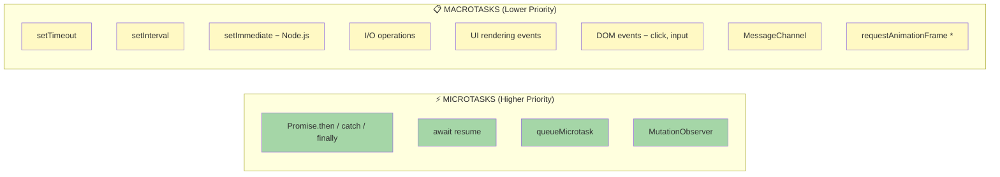

> \* `requestAnimationFrame` runs before repaint, between macrotasks

---

## 💡 Easy Memory Tricks

- **Call Stack** = "**Chef's Kitchen**" — only one dish at a time, LIFO (last order prepared first)
- **Web APIs** = "**Delivery Services**" — send orders out, they come back when ready
- **Microtask Queue** = "**VIP Line**" — always served before regular queue, ALL VIPs first
- **Callback Queue** = "**Regular Line**" — served one at a time, only when VIP line is empty
- **Event Loop** = "**Doorman**" — checks: Kitchen empty? → VIP line first → then Regular line

---

## 🎯 Quick Decision Guide: When Does My Code Run?

| Code | Type | Queue | Priority |
|------|------|-------|----------|
| `console.log()` | Synchronous | Call Stack | 🔴 Immediate |
| `Promise.then()` | Microtask | Microtask Queue | 🟢 After sync, before macrotask |
| `await` resume | Microtask | Microtask Queue | 🟢 After sync, before macrotask |
| `queueMicrotask()` | Microtask | Microtask Queue | 🟢 After sync, before macrotask |
| `setTimeout(fn, 0)` | Macrotask | Callback Queue | 🟡 After ALL microtasks |
| `setInterval()` | Macrotask | Callback Queue | 🟡 After ALL microtasks |
| `fetch().then()` | Microtask | Microtask Queue | 🟢 When response arrives |
| DOM event callback | Macrotask | Callback Queue | 🟡 When event fires |
| `requestAnimationFrame` | Special | Before repaint | 🔵 Before next paint |
| `new Promise(executor)` | **Synchronous!** | Call Stack | 🔴 Immediate |

---

## 🔬 Node.js Event Loop (Bonus)

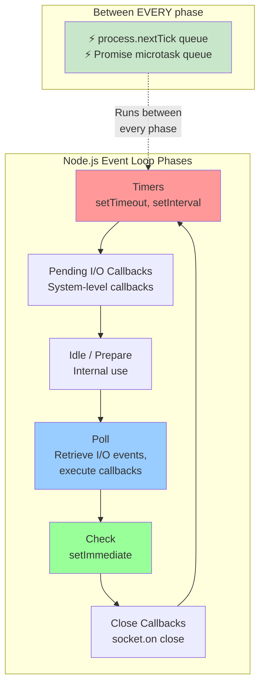

### Node.js Priority Order:
```
1. process.nextTick()      ← Highest priority (even above Promise)
2. Promise.then()          ← Microtask
3. setTimeout(fn, 0)       ← Timers phase
4. setImmediate()          ← Check phase
5. I/O callbacks           ← Poll phase
```

```javascript
// Node.js specific example
setTimeout(() => console.log("setTimeout"), 0);
setImmediate(() => console.log("setImmediate"));
process.nextTick(() => console.log("nextTick"));
Promise.resolve().then(() => console.log("Promise"));
console.log("sync");

// Output:
// sync
// nextTick
// Promise
// setTimeout (or setImmediate — order varies here!)
// setImmediate (or setTimeout)
```

---

## 🧪 Test Yourself — Predict the Output!

### Challenge 1: Warm Up
```javascript
setTimeout(() => console.log("A"), 0);
Promise.resolve().then(() => console.log("B"));
console.log("C");
```
<details>
<summary>Click for answer</summary>

```
C → B → A
```
Sync first (C), then microtask (B), then macrotask (A).
</details>

---

### Challenge 2: Medium
```javascript
console.log("1");
setTimeout(() => console.log("2"), 0);
Promise.resolve().then(() => {
    console.log("3");
    setTimeout(() => console.log("4"), 0);
});
Promise.resolve().then(() => console.log("5"));
console.log("6");
```
<details>
<summary>Click for answer</summary>

```
1 → 6 → 3 → 5 → 2 → 4
```
Sync: 1, 6. Microtasks: 3 (creates timeout for "4"), 5. Macrotasks: 2, 4.
</details>

---

### Challenge 3: Hard
```javascript
async function a() {
    console.log("a1");
    await b();
    console.log("a2");
}
async function b() {
    console.log("b1");
    await c();
    console.log("b2");
}
async function c() {
    console.log("c1");
}
console.log("start");
a();
console.log("end");
```
<details>
<summary>Click for answer</summary>

```
start → a1 → b1 → c1 → end → b2 → a2
```
- `start` (sync), `a1` (sync entering a), `b1` (sync entering b), `c1` (sync in c)
- `await c()` pauses b → `b2` becomes microtask
- `await b()` pauses a → `a2` queued after `b2` resolves
- `end` (sync), then microtasks: `b2`, then `a2`
</details>

---

### Challenge 4: Expert
```javascript
console.log("1");

setTimeout(() => {
    console.log("2");
    Promise.resolve().then(() => console.log("3"));
});

new Promise(resolve => {
    console.log("4");
    setTimeout(() => console.log("5"));
    resolve();
}).then(() => {
    console.log("6");
    return new Promise(resolve => {
        console.log("7");
        resolve();
    }).then(() => console.log("8"));
}).then(() => console.log("9"));

console.log("10");
```
<details>
<summary>Click for answer</summary>

```
1 → 4 → 10 → 6 → 7 → 8 → 9 → 2 → 3 → 5
```
**Sync:** 1, 4 (Promise constructor), 10  
**Microtasks:** 6 (first .then) → 7 (sync in new Promise) → 8 (.then of inner) → 9 (.then of outer chain)  
**Macrotasks:** 2 → 3 (microtask created inside) → 5
</details>

---

## 📝 Summary

| Concept | Key Point |
|---------|-----------|
| **Call Stack** | LIFO — executes one function at a time, sync only |
| **Web APIs** | Browser handles timers, fetch, events in background threads |
| **Microtask Queue** | Promises, await, queueMicrotask — ALL drain before macrotasks |
| **Callback Queue** | setTimeout, events — ONE processed, then check microtasks |
| **Event Loop** | Orchestrates everything: Sync → ALL Microtasks → ONE Macrotask → repeat |
| **Promise constructor** | The executor function runs SYNCHRONOUSLY |
| **await** | Everything after `await` becomes a microtask |
| **setTimeout(fn, 0)** | Not instant — goes to Callback Queue, waits for stack + microtasks |
| **Microtask starvation** | Infinite microtasks block macrotasks and rendering forever |

---

## 🎓 Key Takeaways

1. **JavaScript is single-threaded** — one thing at a time on the Call Stack
2. **Asynchronous ≠ Parallel** — it's concurrent via the Event Loop, not truly parallel
3. **Microtasks are VIP** — they ALWAYS cut the line ahead of macrotasks
4. **After EVERY macrotask**, the Event Loop checks for microtasks before the next macrotask
5. **Promise constructors are sync** — only `.then`/`.catch`/`.finally` are async
6. **`await` is just sugar** — it splits the function into sync (before) and microtask (after)
7. **`setTimeout(fn, 0)` isn't 0ms** — it means "as soon as possible after sync + microtasks"
8. **Don't starve the Event Loop** — avoid infinite microtask chains

---

*Created: February 17, 2026*
*Diagrams use Mermaid syntax — view in VS Code with a Mermaid preview extension or on GitHub.*
